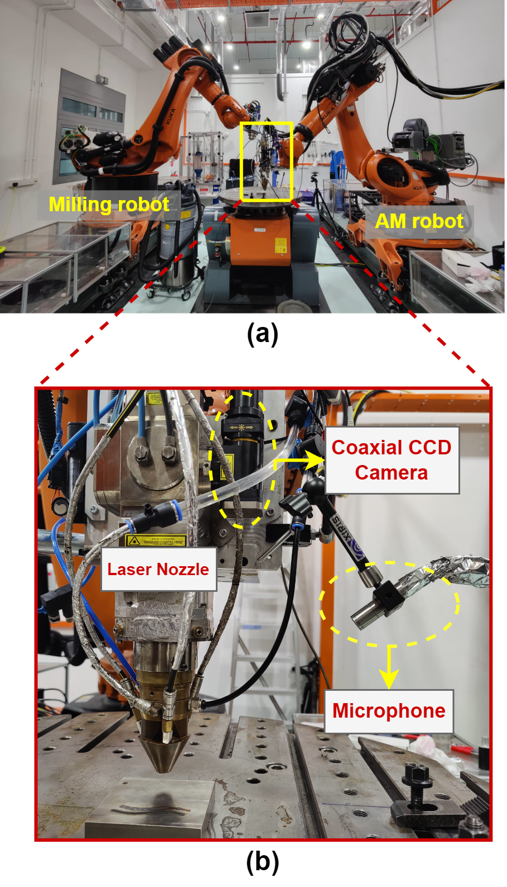
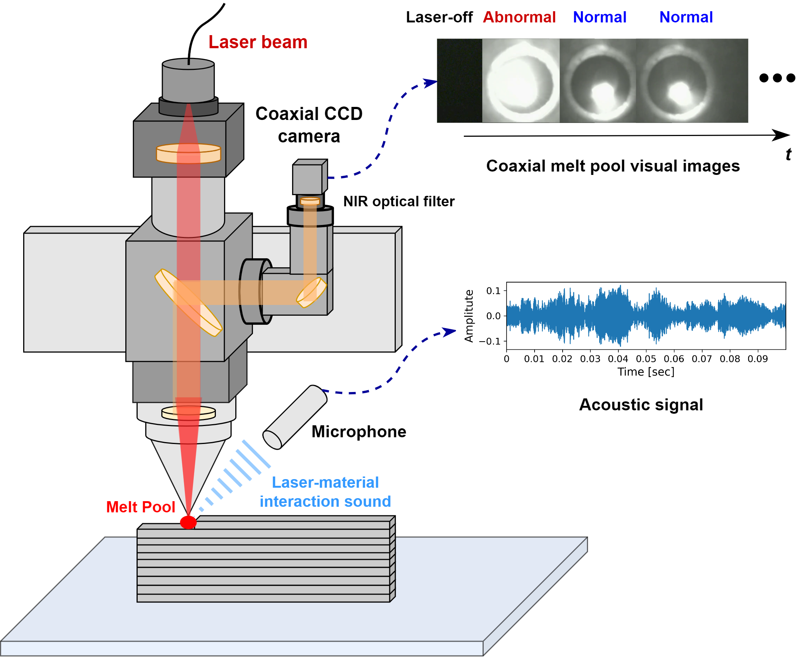

# LDED-FusionNet: Machine Learning-Based Audio-Visual Defect Detection for LDED AM Process
## Overview
This repository contains the implementation for **multisensor fusion-based digital twin modeling** in **Laser-Directed Energy Deposition (LDED)**. The approach integrates **audio-visual feature extraction** and **machine learning (ML) models** to predict localized quality in **robotic LDED**.

### **Visual Summary**
#### **Multisensor Fusion-Based Digital Twin Framework**
<div align="center">
  
</div>

#### **Experimental Setup and Schematic Representation**
<table align="center" width="800px" style="border:none;">
  <tr style="border:none;">
    <td align="center" width="320px" style="border:none;">
      
      <br><b>Experimental Setup</b>
    </td>
    <td align="center" width="480px" style="border:none;">
      
      <br><b>Schematic Representation</b>
    </td>
  </tr>
</table>


### **Related Publications**

1. **Multisensor Fusion-Based Digital Twin for Localized Quality Prediction in Robotic Laser-Directed Energy Deposition**
   - Published in *Robotics and Computer-Integrated Manufacturing (RCIM), 2023*
   - DOI: [https://www.sciencedirect.com/science/article/abs/pii/S0736584523000571](https://www.sciencedirect.com/science/article/abs/pii/S0736584523000571)
   - Proposes a **Multisensor Fusion-Based Digital Twin**, leveraging **feature-level fusion** of **acoustic and visual data** for LDED quality prediction.

2. **In-situ Defect Detection in Laser-Directed Energy Deposition with Machine Learning and Multi-Sensor Fusion**
   - Published in *Journal of Mechanical Science and Technology (JMST), 2024*
   - DOI: [https://link.springer.com/article/10.1007/s12206-024-2401-1](https://link.springer.com/article/10.1007/s12206-024-2401-1)
   - Explores **audio-visual feature correlations**, analyzing **acoustic signals across multiple domains** and **coaxial melt pool images** to train ML models. 
   - Introduces **intra-modality and cross-modality correlation analysis**, identifying key **acoustic and vision-based signatures** in LDED process dynamics.

3. **Inference of Melt Pool Visual Characteristics in Laser Additive Manufacturing Using Acoustic Signal Features and Robotic Motion Data**
   - Published in *ICCAR 2024*
   - DOI: [https://ieeexplore.ieee.org/abstract/document/10569391](https://ieeexplore.ieee.org/abstract/document/10569391)
   - Proposes a novel technique to **infer melt pool visual characteristics** in LAM by combining **acoustic signal features** with **robotic tool-center-point (TCP) motion data**.
   - Demonstrates that **acoustic + TCP motion data fusion** achieves an **R² score above 0.7**, outperforming acoustic-only models.
   - Highlights the potential of **microphone-based monitoring** as a **cost-effective alternative** for **melt pool tracking and closed-loop control** in LAM


### **Repository Upgrade**
This repository is an **updated version** of the previous repository:
🔗 [LDED-Multisensor-Fusion](https://github.com/Davidlequnchen/LDED-multisensor-fusion), which originally supported the RCIM paper. Key improvements include:
- **Essentia-based Acoustic Feature Extraction**: Replaces `librosa` with `Essentia`, which is more systematic, efficient, and suitable for **production ML algorithms**.
- **Expanded Cross-Modality Analysis**: Provides an in-depth understanding of **audio-visual feature correlation**, along with additional **ablation studies** to analyze feature effectiveness.
- **Excludes Virtual Quality Map Construction**: Unlike the previous repository, this code **does not include spatial registration of robot motion into multisensor features** or ML predictions. The **visualization and virtual quality map construction** remain in the **older repository**: 🔗 [LDED-Multisensor-Fusion](https://github.com/Davidlequnchen/LDED-multisensor-fusion).

## Installation

- Create a new conda environment with Python version 3.8.10:
  ```
  conda create --name torch python=3.8.10
  ```  
- Activate your torch environment:
  ```
  conda activate torch
  ```
- Check CUDA Version:
  ```
  nvcc --version
  ```
- Check the driver API version:
  ```
  nvidia-smi
  ```
- Install PyTorch (for example, if using CUDA 11.0):
  ```
  conda install pytorch torchvision torchaudio cudatoolkit=11.0 -c pytorch
  ```
- Verify GPU installation:
  ```python
  import torch
  print(torch.cuda.is_available())
  ```
- Install the required dependencies:
  ```
  pip install -r requirements.txt
  ```

## Features
- **Multisensor Data Fusion**: Feature-level fusion of **audio and visual** data for LDED quality prediction.
- **Audio-Visual Feature Extraction**: Implements domain-specific **acoustic signal processing** and **image-based feature extraction**.
- **Machine Learning Models**: Supports training ML models for **defect detection and process quality prediction**.
- **Cross-Modality Correlation Analysis**: Investigates relationships between **acoustic features** and **melt pool images**.

## Repository Structure
```
LDED-FusionNet/
│── code/                  # Source code for feature extraction, modeling, and evaluation
│── result_images/         # Visual results of the analysis
│── saved_scalers/         # Precomputed scalers for data normalization
│── trained_models/        # Saved ML models
│── README.md              # Project documentation
│── requirements.txt       # Required dependencies
```

## System Requirements
- **Operating System**: Ubuntu Linux
- **Python Version**: 3.9+
- **Required Libraries:**
  ```bash
  pip install numpy pandas scikit-learn essentia opencv-python torch torchvision
  ```
- **GPU Support** (optional for deep learning models)
  ```bash
  pip install torch torchvision torchaudio --extra-index-url https://download.pytorch.org/whl/cu113
  ```

## Citation
If you use this repository, please cite the following papers:

```
@article{chen2023digitaltwin,
  author    = {Chen, Lequn and others},
  title     = {Multisensor Fusion-Based Digital Twin for Localized Quality Prediction in Robotic Laser-Directed Energy Deposition},
  journal   = {Robotics and Computer-Integrated Manufacturing},
  year      = {2023},
  url       = {https://www.sciencedirect.com/science/article/abs/pii/S0736584523000571}
}
```

## License
This repository is released under the MIT License.

